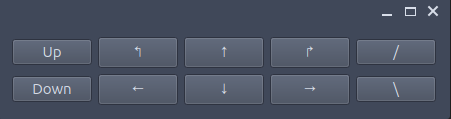

# Challenge 1 - Part 1: Controlling Thrusters
## Making a Basic PyQt GUI
 - Create a new file called `gui.py` in the top level folder of this repo.
 - The entry point for a Python file is this if statement:
    ```python
    if __name__ == '__main__':
    ```
   We'll have this statement call a `main` function where the rest of our code will be:
    ```python
    def main():
        pass

    if __name__ == '__main__':
        main()
    ```
   Note that the `main` function needs to be defined before it is called in the if statement. The `pass` keyword here is telling Python the function doesn't do anything yet.
 - Now we can create an empty window in the `main` function:
    ```python
    def main():
        app = QApplication([])

        window = QWidget()
        window.show()

        app.exec()
    ```
   Remember you'll need to import `QApplication` and `QWidget` at the top of the file:
    ```python
    from PyQt6.QtWidgets import QApplication, QWidget
    ```
   Now the `QWidget` we created in `main` will be the graphical widget that contains the rest of our GUI.
 - Run the GUI with `python3 gui.py` in the console/terminal. You should see an empty window.

## Adding a Button Panel
 - To break things up, we'll define a new class that inherits from `QWidget` to hold all our buttons. Make sure to put it before the `main` function!
    ```python
    class ButtonPanel(QWidget):
        def __init__(self) -> None:
            super().__init__()
    ```
    The `__init__` function is the `ButtonPanel`'s constructor (the method that is called when we instantiate a new `ButtonPanel`). It accepts `self`, which is a reference to the `ButtonPanel` instance. `super().__init__()` calls the superclass's `__init__` function (in this case, `QWidget`'s).
 - Before we go on, replace the `QWidget` we were creating in `main` with your new widget class:
    ```python
    window = ButtonPanel()
    ```
   You should be able to run your app again and see that nothing has changed.
 - Now add a layout to the `ButtonPanel`, to determine how widgets will be layed out inside it:
    ```python
    class ButtonPanel(QWidget):
        def __init__(self) -> None:
            super().__init__()

            layout = QVBoxLayout()
            self.setLayout(layout)
    ```
   The `QVBoxLayout` will align any other widgets we put in it vertically (that's why it's a Q***V***Box).
 - We'll add two `QHBoxLayout`s to the `QVBoxLayout`, making a grid with a vertical dimension of 2. Remember to add the layouts to your import statement at the top of the file.
   ```python
   from PyQt6.QtWidgets import QApplication, QWidget, QVBoxLayout, QHBoxLayout, QPushButton
   ```
   ```python
    class ButtonPanel(QWidget):
        def __init__(self) -> None:
            super().__init__()

            layout = QVBoxLayout()
            self.setLayout(layout)

            top_layout = QHBoxLayout()
            layout.addLayout(top_layout)
            
            bottom_layout = QHBoxLayout()
            layout.addLayout(bottom_layout)
    ```
 - Now we can add our buttons. You can pick any layout you think is good, just make sure you have buttons for moving up/down, left/right, forward/back, as well as for yawing (turning) left/right and pitching (tilting) up/down. That'll give us 5 Degrees of Freedom (DoF), which is one less than the robot is capable of, but should be all we need. For each button, you'll need to create a `QPushButton` and add it to the `top_layout` or the `bottom_layout`, for example:
    ```python
    class ButtonPanel(QWidget):
        def __init__(self) -> None:
            
            ...

            forward = QPushButton('↑')
            top_layout.addWidget(forward)
    ```
   Again, make sure to import `QPushButton` from `PyQt6.QtWidgets`.
 - Now you should have a panel of buttons that do absolutely nothing. Here's mine:

    

## Click Signals
To make our buttons do things, we can connect them to functions.

 - First we'll create a function that will be run on a button press:
    ```python
    class ButtonPanel(QWidget):
        def __init__(self) -> None:
            ...
        
        def on_button_press(self):
            print('Button was pressed!')
    ```
 - Then we can connect it to the click signal on a button:
    ```python
    class ButtonPanel(QWidget):
        def __init__(self) -> None:
            ...
            forward.clicked.connect(self.on_button_press)
    ```
 - Now whenever you click the button you connected, `Button was pressed!` should appear in the console.
 - We could make a separate version of this function for every button, but that would be a pain. Instead, we'll use a single function for all of our buttons, so they'll need to send a short message to tell our function which button was pressed. I'll create an `Enum` class to represent each type of movement and use a boolean to represent whether that movement was in the "positive" direction, but feel free to use a different data structure.
    ```python
    from enum import Enum

    class MovementType(Enum):
        Forward = 1  # Forward/backward
        Vertical = 2  # Up/down
        Lateral = 3  # Left/right
        Pitch = 4  # Tilting up/down
        Yaw = 5  # Turning left/right
    ```
 - Now we can modify our function to accept the custom message. I'll write the function to accept a `MovementType` and a boolean to represent direction, so the "move forward" button would correspond with a parameter set of `MovementType.Forward, True`. For now we can just print out what we receive for debugging.
    ```python
    class ButtonPanel(QWidget):
        def __init__(self) -> None:
            ...

        def on_button_press(self, movement_type: MovementType, direction: bool):
            direction_str = 'positively' if direction else 'negatively'
            print(f'Moving: {movement_type.name} {direction_str}')
    ```
 - Finally, we can connect each of our buttons' `clicked` signals to the function. We'll need to use a `lambda` function (Python's anonymous function operator) to pass our custom movement type and direction for each button.
    ```python
    class ButtonPanel(QWidget):
        def __init__(self) -> None:
            ...
            forward.clicked.connect(
                lambda: self.on_button_press(MovementType.Forward, True))
            backward.clicked.connect(
                lambda: self.on_button_press(MovementType.Forward, False))
            # etc.
    ```

## 🎉 R O S 2 🎉
### Introduction
ROS2, or Robot Operating System 2, is a software framework that makes it easy for different processes to communicate with each other in real time. (It's not actually an operating system.) We'll sometimes call ROS2 just ROS because we're lazy, although the old ROS/ROS1 does differ from ROS2 significantly.

There are good tutorials in the [ROS2 docs](https://docs.ros.org/en/jazzy/index.html), but I'll give an intro here. To interact with ROS, we have to create *nodes*. Usually, a node represents one component in the system. We might have one node for reading data from a temperature sensor, or one for controlling our robot's manipulators (claws). To send messages to the rest of the system, a node can create one or more *publishers*. A node can use a publisher to publish messages on a single *topic*. A topic is identified by a string. `arming`, `temperature`, and `front_cam` are all valid topic names. If a publisher publishes a message on a topic, then all nodes that have created *subscribtions* to that topic will receive the message.

To summarize:
 - Nodes can have multiple publishers (which each can send messages on a single topic) and/or multiple subscriptions (which each subscribe to a single topic).
 - Messages are published and received on topics, which are represented by strings.
 - Any number of publishers and subscriptions can publish/subscribe on a single topic.


### Context for this bootcamp
ROS2 has very specific installation requirements. The latest version of ROS works best on the latest version of [Ubuntu](https://ubuntu.com/download), a Linux distro. While you're working on this bootcamp, you should also take a look at our [main codebase readme](https://github.com/CWRUbotix/rov-25?tab=readme-ov-file#table-of-contents) for installation instructions on various operating systems.

But because it takes a while to install ROS, this bootcamp won't actually use ROS at all. Instead, we'll be using a very experimental "testing harness" (in the `bootcamp_harness` folder of this repo) that should provide almost the same behavior and interface as ROS.

But there will be some differences. ROS has its own system for "launching" processes that we won't cover (you can read about it [here](https://docs.ros.org/en/jazzy/Tutorials/Intermediate/Launch/Launch-Main.html)). Instead, we'll just be running our code as regular Python files. We'll also need to have `bootcamp_harness/rclpy/broker.py` running before we run our code, whereas in real ROS you don't need to manually run any "background" processes.

Finally, when we do imports from ROS during this bootcamp, they'll look something like this:
```python
from bootcamp_harness.rclpy.node import Node
```

When in normal ROS they would look like:
```python
from rclpy.node import Node
```

### Controlling Thrusters
Now we can connect our button click function to a publisher that will send `PixhawkInstruction` messages on the `pixhawk_control` topic. In real life, these are recieved by another ROS node running on the Raspberry Pi inside the robot, which then instructs our Pixhawk flight computer to move the thrusters.

 - First, let's import a bunch of different things from `bootcamp_harness.rclpy`:
    ```python
    from bootcamp_harness.rclpy.node import Node
    from bootcamp_harness.rclpy.qos import QoSPresetProfiles
    from bootcamp_harness.rov_msgs.msg import PixhawkInstruction
    from bootcamp_harness import rclpy
    ```
 - Then we can add `rclpy.init()` to our `main` function, to enable ROS in our script:
    ```python
    def main():
        rclpy.init()
        ...
    ```
 - Now we can create a node in our `ButtonPanel` class's `__init__` method. The `Node` constructor take a single string parameter for the node name. It's not super critical, but it's good to make them descriptive.
    ```python
    def __init__(self):
        super().__init__()

        node = Node('pixhawk_publisher')
        ...
 - We want to publish messages, so we'll add a publisher to the node. Publishers take three arguments: a message type, a topic name, and a Quality of Service (QoS) value. We'll use the default QoS and a topic name of `pixhawk_control`. We imported our message type already, `PixhawkInstruction`.
    ```python
    node = Node('pixhawk_publisher')
    self.pixhawk_publisher = node.create_publisher(
        PixhawkInstruction,
        'pixhawk_control',
        QoSPresetProfiles.DEFAULT.value
    )
    ```
 - You can take a look at the message definition for `PixhawkInstruction`s in the file `bootcamp_harness/rov_msgs/msg/PixhawkInstruction.msg`. It looks something like this:
    ```msg
    float32 forward
    float32 vertical
    float32 lateral
    float32 pitch
    float32 yaw
    float32 roll

    uint8 MANUAL_CONTROL = 0
    uint8 KEYBOARD_CONTROL = 1
    uint8 AUTONOMOUS_CONTROL = 2

    uint8 author
    ```
   You don't need to worry about the specifics here too much. Just notice that there are fields in this message called `forward`, `vertical`, `lateral`, etc., and that these are all floats. There's also an integer `author` field, and constant values for manual, keyboard, and autonomous control.
 - In Python, that means we can create a `PixhawkInstruction` like so:
    ```python
    PixhawkInstruction(
        forward=0.5,
        vertical=-0.25,
        author=PixhawkInstruction.MANUAL_CONTROL
    )
    ```
   The `author` field is more important in our actual codebase; we'll always use `PixhawkInstruction.MANUAL_CONTROL` for this project. We can assign values to any number of other fields when we create a `PixhawkInstruction`. All of the floating point fields are from -1.0 to 1.0, where the extremes are "full throttle" in that direction.
 - To test things out, let's publish a `PixhawkInstruction` using our publisher whenever we press a button. In the `on_button_press` function, create and publish a `PixhawkInstruction` object using `self.publisher`.
    ```python
    instruction = PixhawkInstruction(
        ...
    )
    self.pixhawk_publisher.publish(instruction)
    ```
 - To see the results of publishing these messages, we'll need to run `bootcamp_harness/rclpy/broker.py` (to make our janky pseudo-ROS work) and `mavros_launch.py` (which subscribes to the `pixhawk_control` topic) in addition to our `gui.py`. Run each of these in its own terminal in VSCode:
    ```python
    python3 bootcamp_harness/rclpy/broker.py
    python3 mavros_launch.py
    python3 gui.py
    ```
 - Clicking buttons on your GUI should now cause messages to display in the `mavros_launch.py` terminal. They should show the parameters you included in the `PixhawkInstruction` messages you published.
 - Now we can modify `on_button_press` to create messages corresponding to each button's direction. We'll stick to a max thruster magnitude of 0.5 to avoid damaging any hardware in the future. I'll give an example with two of the fields filled out, you should continue with the rest (except for roll).
    ```python
    value = 0.5 if direction else -0.5

    instruction = PixhawkInstruction(
        forward=(value if movement_type == MovementType.Forward else 0),
        vertical=(value if movement_type == MovementType.Vertical else 0),
        ...
        author=PixhawkInstruction.MANUAL_CONTROL
    )
    ```
 - Running the broker, mavros, and the GUI again should show that the instructions received by the Pixhawk now depend on which button was pressed.

## Improving the Button Panel
We just wrote a GUI that can control the robot, but it's not the best. Here are some possible improvements.
 1. (definitely do this) There's no way to stop! Make a button that stops the robot by sending a message with 0s for all the directional parameters.
 2. (optional) The GUI file has a lot of repeated code. Rewrite the GUI initialization and/or click handler so you don't have to repeat yourself as much.
 3. (harder optional - only if you're way ahead or bored) Controlling a robot with buttons is awkward. Write something to control it with another input. Keyboard? PlayStation controller?
